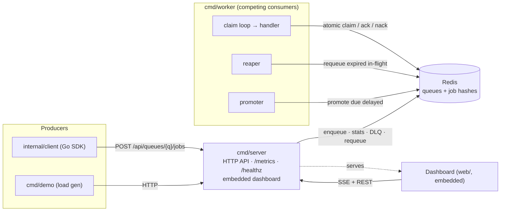

# Relay

[](https://github.com/StrangeNoob/relay/actions/workflows/ci.yml)

A distributed task queue built **from scratch on Redis primitives**, in Go. The point of this
project is to prove understanding of queue internals — the atomic claim, visibility timeouts, the
reaper, retries, priority, idempotency, rate limiting — rather than to wrap an existing library.

## Architecture



Producers enqueue over HTTP (or the Go SDK); the server is a thin JSON layer over the broker and
also serves the live dashboard and Prometheus metrics. Workers are competing consumers that claim
jobs atomically, run a handler, and ack/nack; two background loops (reaper, promoter) plus an
operator requeue are the only other things that move jobs between states. Redis is the durable
substrate — every queue guarantee is enforced by our own logic and embedded Lua scripts.

## Delivery semantics & invariants

- **At-least-once delivery, never exactly-once.** Idempotency keys let consumers dedup; nothing here
  claims exactly-once.
- **The atomic claim is sacred.** Popping a job from `ready`, adding it to `inflight` under a
  visibility deadline, and bumping attempts is a single Lua script — competing consumers can never
  claim the same job.
- **Crash safety comes from the reaper.** A worker dying mid-job is recovered because its visibility
  deadline expires and the reaper requeues the job.
- **Built from scratch on Redis primitives.** The only Go dependencies are a Redis driver and the
  Prometheus client; the queue logic is ours.

## Features

Competing consumers · priority queues · delayed/scheduled jobs · retries with full-jitter backoff ·
dead-letter queue with inspect + requeue · visibility timeout + reaper · idempotency keys · per-queue
rate limiting (token bucket) · Prometheus metrics · live dashboard · a producer SDK.

## Quickstart (Docker)

```bash
docker compose -f deployments/docker-compose.yml up --build
```

Then open <http://localhost:8080>. The `demo` container enqueues 200 jobs; the worker processes them
(failing ~10% so you get retries and a dead-letter queue to watch). The dashboard shows live queue
depth, throughput, and the DLQ — click **Requeue** on a dead job to send it back. Scale the workers:

```bash
docker compose -f deployments/docker-compose.yml up --build --scale worker=3
```

Generate more load any time:

```bash
docker compose -f deployments/docker-compose.yml run --rm demo \
  /usr/local/bin/demo -server http://server:8080 -queue demo -count 500
```

## Local development

Needs Go 1.24+ and a Redis on `localhost:6379` (tests skip when none is reachable).

```bash
go run ./cmd/server -queues demo            # API + dashboard on :8080
go run ./cmd/worker -queue demo -concurrency 4
go run ./cmd/demo   -server http://localhost:8080 -queue demo -count 100

go test -race ./...                         # broker/worker/api/client tests use real Redis
golangci-lint run
```

The dashboard lives in `web/` (Vite + React + TypeScript); rebuild it with `cd web && npm ci && npm run build` (the built `web/dist` is committed and embedded into the server).

## Project layout

```
cmd/{server,worker,demo}   # thin entrypoints
internal/job               # job model + Redis-hash encoding
internal/broker            # the engine: enqueue/claim/ack/nack/reap/promote + Lua scripts
internal/worker            # consumer runtime (claim loop, reaper, promoter)
internal/metrics           # Prometheus recorder + depth collector
internal/api               # HTTP JSON API + SSE stream
internal/client            # producer SDK (stdlib-only HTTP client)
web/                       # embedded dashboard (Vite + React + TS)
deployments/               # docker-compose stack
```

## Deploy

The image is a self-contained binary set, so any container host works. Example (Fly.io-style):

1. Provision a managed Redis and note its address.
2. Build and push the image: `docker build -t <registry>/relay:latest . && docker push <registry>/relay:latest`.
3. Run the **server** (`/usr/local/bin/server -addr :8080 -redis <redis-addr> -queues <queues>`),
   exposing port 8080, and one or more **workers**
   (`/usr/local/bin/worker -redis <redis-addr> -queue <queue>`), pointed at the same Redis.
4. Point producers at the server's URL (the Go SDK, or `cmd/demo -server <url>`).

There is no auth — put it behind your platform's access controls if exposed publicly.

## Design docs

The authoritative designs live in [`docs/superpowers/specs/`](docs/superpowers/specs/); the base
design is the source of truth for architecture and delivery semantics. `CLAUDE.md` summarizes the
data model, invariants, and known limitations.
