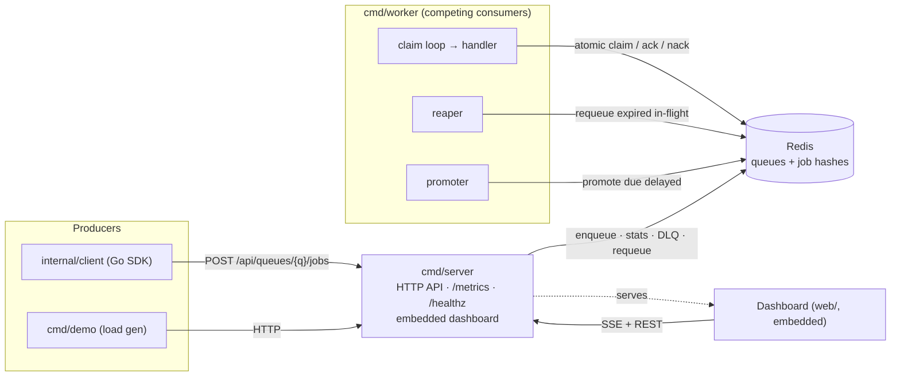

# Phase 3d Packaging, Deploy & README Implementation Plan

> **For agentic workers:** REQUIRED SUB-SKILL: Use superpowers:subagent-driven-development (recommended) or superpowers:executing-plans to implement this plan task-by-task. Steps use checkbox (`- [ ]`) syntax for tracking.

**Goal:** Make Relay runnable and presentable in one step — a multi-stage Dockerfile, a docker-compose stack that runs the whole system end-to-end, the portfolio README with a mermaid architecture diagram, and a CI image-build job.

**Architecture:** One multi-stage `Dockerfile` builds all three Go binaries into a tiny distroless image (the server embeds the committed `web/dist`, so no Node step). `deployments/docker-compose.yml` runs redis + server + scalable workers + a one-shot demo from that shared image. The README is the front door; CI gains a `docker build` job so the Dockerfile can't rot. No queue logic changes.

**Tech Stack:** Docker (multi-stage, distroless/static:nonroot), Docker Compose, GitHub Actions, Markdown + mermaid. Go 1.24 / toolchain go1.25.11.

**Spec:** [`docs/superpowers/specs/2026-06-09-relay-phase3d-packaging-deploy-readme-design.md`](../specs/2026-06-09-relay-phase3d-packaging-deploy-readme-design.md)

**Environment note:** Docker (29.x) and Compose (v5) are available in the dev environment, so the build/compose validation steps are real. If Docker is somehow unavailable at execution time, report BLOCKED for the validation steps rather than skipping silently.

---

## File Structure

- **Create `.dockerignore`** — keep the build context lean (exclude `.git`, `web/node_modules`, `.superpowers`, `docs`).
- **Create `Dockerfile`** (repo root) — multi-stage: golang builder → distroless runtime with all three binaries.
- **Create `deployments/docker-compose.yml`** — redis + server + worker(s) + demo.
- **Modify `.github/workflows/ci.yml`** — add a `docker` build job.
- **Create `README.md`** — the portfolio front page (mermaid diagram, quickstart, features, invariants, deploy, design-docs pointer).
- **Modify `CLAUDE.md`** — mark Phase 3 complete.

---

## Task 1: `.dockerignore` + `Dockerfile`

**Files:** Create `.dockerignore`, `Dockerfile`

- [ ] **Step 1: Create `.dockerignore`**

```
.git
.github
web/node_modules
.superpowers
docs
*.test
relay
```

(Excluding `web/node_modules` is the big win; `docs`/`.superpowers` keep the context small. `web/dist` is NOT excluded — the server embeds it.)

- [ ] **Step 2: Create `Dockerfile`**

```dockerfile
# syntax=docker/dockerfile:1

# --- builder ---
FROM golang:1.25 AS build
WORKDIR /src

# Cache module downloads.
COPY go.mod go.sum ./
RUN go mod download

# Build all three binaries. web/dist is committed, so the server embeds the
# dashboard with no Node step.
COPY . .
RUN CGO_ENABLED=0 go build -trimpath -ldflags="-s -w" -o /out/server ./cmd/server \
 && CGO_ENABLED=0 go build -trimpath -ldflags="-s -w" -o /out/worker ./cmd/worker \
 && CGO_ENABLED=0 go build -trimpath -ldflags="-s -w" -o /out/demo   ./cmd/demo

# --- runtime ---
FROM gcr.io/distroless/static:nonroot
COPY --from=build /out/server /usr/local/bin/server
COPY --from=build /out/worker /usr/local/bin/worker
COPY --from=build /out/demo   /usr/local/bin/demo
EXPOSE 8080
# Each compose service overrides `command`; default to the server.
CMD ["/usr/local/bin/server"]
```

- [ ] **Step 3: Build the image (validation)**

Run:
```bash
cd /Users/leon/WorkSpace/relay   # or the worktree root
docker build -t relay:ci .
```
Expected: build succeeds. Then verify the binaries exist in the image:
```bash
docker run --rm --entrypoint /usr/local/bin/server relay:ci -h 2>&1 | head -3 || true
docker image inspect relay:ci >/dev/null && echo "image OK"
```
Expected: `image OK` (the `-h` may exit non-zero printing flag usage — that's fine; it proves the binary runs). If `docker build` fails because `golang:1.25` cannot satisfy the `toolchain go1.25.11` pin, change the builder base to a tag that does (e.g. `golang:1.25.11`) and note the change.

- [ ] **Step 4: Commit**

```bash
git add .dockerignore Dockerfile
git commit -m "Add multi-stage Dockerfile building server/worker/demo into a distroless image"
```

---

## Task 2: `deployments/docker-compose.yml`

**Files:** Create `deployments/docker-compose.yml`

- [ ] **Step 1: Create the compose file**

```yaml
# Runs the whole Relay system end-to-end: Redis, the API/dashboard server, a pool
# of workers (competing consumers + reaper + promoter), and a one-shot demo load
# generator. Open http://localhost:8080 after `up` to watch the dashboard.
#
#   docker compose -f deployments/docker-compose.yml up --build
#   docker compose -f deployments/docker-compose.yml up --build --scale worker=3
#
services:
  redis:
    image: redis:7
    healthcheck:
      test: ["CMD", "redis-cli", "ping"]
      interval: 3s
      timeout: 3s
      retries: 10

  server:
    build:
      context: ..
      dockerfile: Dockerfile
    image: relay:local
    command: ["/usr/local/bin/server", "-addr", ":8080", "-redis", "redis:6379", "-queues", "demo"]
    ports:
      - "8080:8080"
    depends_on:
      redis:
        condition: service_healthy

  worker:
    build:
      context: ..
      dockerfile: Dockerfile
    image: relay:local
    command: ["/usr/local/bin/worker", "-redis", "redis:6379", "-queue", "demo", "-concurrency", "4", "-fail-rate", "0.1"]
    depends_on:
      redis:
        condition: service_healthy

  demo:
    build:
      context: ..
      dockerfile: Dockerfile
    image: relay:local
    command: ["/usr/local/bin/demo", "-server", "http://server:8080", "-queue", "demo", "-count", "200"]
    depends_on:
      server:
        condition: service_started
    restart: "no"
```

(All three app services share one `image: relay:local`, so the build runs once. `worker` has no `container_name` or published port, so `--scale worker=N` works.)

- [ ] **Step 2: Validate the compose file**

Run:
```bash
docker compose -f deployments/docker-compose.yml config >/dev/null && echo "compose config OK"
```
Expected: `compose config OK` (no schema errors).

- [ ] **Step 3: End-to-end bring-up (validation)**

Run:
```bash
docker compose -f deployments/docker-compose.yml up --build -d redis server worker
# wait for the server to be reachable
for i in $(seq 1 30); do curl -fsS localhost:8080/healthz >/dev/null 2>&1 && break; sleep 1; done
curl -s localhost:8080/healthz; echo                       # ok
docker compose -f deployments/docker-compose.yml run --rm demo   # enqueue 200 jobs
sleep 3
curl -s localhost:8080/api/queues; echo                    # ["demo"]
curl -s localhost:8080/api/queues/demo/stats; echo         # non-zero activity
curl -s -o /dev/null -w "%{http_code}\n" localhost:8080/   # 200 (dashboard)
curl -s localhost:8080/metrics | grep -c '^relay_'         # >0 relay_ metric lines
docker compose -f deployments/docker-compose.yml down -v
```
Expected: `ok`; `["demo"]`; stats with non-zero ready/processed/dlq movement; `200`; a positive metrics count. If Docker is unavailable, report BLOCKED.

- [ ] **Step 4: Commit**

```bash
git add deployments/docker-compose.yml
git commit -m "Add docker-compose stack: redis + server + workers + demo"
```

---

## Task 3: CI `docker` build job

**Files:** Modify `.github/workflows/ci.yml`

- [ ] **Step 1: Add the job**

Append under `jobs:` in `.github/workflows/ci.yml` (same indentation as the existing `test`/`lint`/`web` jobs):

```yaml
  docker:
    name: docker build
    runs-on: ubuntu-latest
    steps:
      - uses: actions/checkout@v4

      - name: Build image
        run: docker build -t relay:ci .
```

Leave the existing `test`, `lint`, and `web` jobs unchanged.

- [ ] **Step 2: Validate the workflow YAML**

Run:
```bash
python3 -c "import yaml,sys; yaml.safe_load(open('.github/workflows/ci.yml')); print('ci.yml OK')"
```
Expected: `ci.yml OK` (valid YAML; the new job parses). If `python3`/pyyaml is unavailable, instead run `docker build -t relay:ci .` locally to confirm the command the job runs works.

- [ ] **Step 3: Commit**

```bash
git add .github/workflows/ci.yml
git commit -m "Add CI job that builds the Docker image"
```

---

## Task 4: `README.md`

**Files:** Create `README.md`

- [ ] **Step 1: Create the README**

Create `README.md` with this content (adjust prose lightly if needed, but keep the structure, the mermaid block, and the commands exact):

````markdown
# Relay

[](https://github.com/StrangeNoob/relay/actions/workflows/ci.yml)

A distributed task queue built **from scratch on Redis primitives**, in Go. The point of this
project is to prove understanding of queue internals — the atomic claim, visibility timeouts, the
reaper, retries, priority, idempotency, rate limiting — rather than to wrap an existing library.

## Architecture



Producers enqueue over HTTP (or the Go SDK); the server is a thin JSON layer over the broker and
also serves the live dashboard and Prometheus metrics. Workers are competing consumers that claim
jobs atomically, run a handler, and ack/nack; two background loops (reaper, promoter) plus an
operator requeue are the only other things that move jobs between states. Redis is the durable
substrate — every queue guarantee is enforced by our own logic and embedded Lua scripts.

## Delivery semantics & invariants

- **At-least-once delivery, never exactly-once.** Idempotency keys let consumers dedup; nothing here
  claims exactly-once.
- **The atomic claim is sacred.** Popping a job from `ready`, adding it to `inflight` under a
  visibility deadline, and bumping attempts is a single Lua script — competing consumers can never
  claim the same job.
- **Crash safety comes from the reaper.** A worker dying mid-job is recovered because its visibility
  deadline expires and the reaper requeues the job.
- **Built from scratch on Redis primitives.** The only Go dependencies are a Redis driver and the
  Prometheus client; the queue logic is ours.

## Features

Competing consumers · priority queues · delayed/scheduled jobs · retries with full-jitter backoff ·
dead-letter queue with inspect + requeue · visibility timeout + reaper · idempotency keys · per-queue
rate limiting (token bucket) · Prometheus metrics · live dashboard · a producer SDK.

## Quickstart (Docker)

```bash
docker compose -f deployments/docker-compose.yml up --build
```

Then open <http://localhost:8080>. The `demo` container enqueues 200 jobs; the worker processes them
(failing ~10% so you get retries and a dead-letter queue to watch). The dashboard shows live queue
depth, throughput, and the DLQ — click **Requeue** on a dead job to send it back. Scale the workers:

```bash
docker compose -f deployments/docker-compose.yml up --build --scale worker=3
```

Generate more load any time:

```bash
docker compose -f deployments/docker-compose.yml run --rm demo \
  /usr/local/bin/demo -server http://server:8080 -queue demo -count 500
```

## Local development

Needs Go 1.24+ and a Redis on `localhost:6379` (tests skip when none is reachable).

```bash
go run ./cmd/server -queues demo            # API + dashboard on :8080
go run ./cmd/worker -queue demo -concurrency 4
go run ./cmd/demo   -server http://localhost:8080 -queue demo -count 100

go test -race ./...                         # broker/worker/api/client tests use real Redis
golangci-lint run
```

The dashboard lives in `web/` (Vite + React + TypeScript); rebuild it with `cd web && npm ci && npm run build` (the built `web/dist` is committed and embedded into the server).

## Project layout

```
cmd/{server,worker,demo}   # thin entrypoints
internal/job               # job model + Redis-hash encoding
internal/broker            # the engine: enqueue/claim/ack/nack/reap/promote + Lua scripts
internal/worker            # consumer runtime (claim loop, reaper, promoter)
internal/metrics           # Prometheus recorder + depth collector
internal/api               # HTTP JSON API + SSE stream
internal/client            # producer SDK (stdlib-only HTTP client)
web/                       # embedded dashboard (Vite + React + TS)
deployments/               # docker-compose stack
```

## Deploy

The image is a self-contained binary set, so any container host works. Example (Fly.io-style):

1. Provision a managed Redis and note its address.
2. Build and push the image: `docker build -t <registry>/relay:latest . && docker push <registry>/relay:latest`.
3. Run the **server** (`/usr/local/bin/server -addr :8080 -redis <redis-addr> -queues <queues>`),
   exposing port 8080, and one or more **workers**
   (`/usr/local/bin/worker -redis <redis-addr> -queue <queue>`), pointed at the same Redis.
4. Point producers at the server's URL (the Go SDK, or `cmd/demo -server <url>`).

There is no auth — put it behind your platform's access controls if exposed publicly.

## Design docs

The authoritative designs live in [`docs/superpowers/specs/`](docs/superpowers/specs/); the base
design is the source of truth for architecture and delivery semantics. `CLAUDE.md` summarizes the
data model, invariants, and known limitations.
````

- [ ] **Step 2: Sanity-check the README**

Run:
```bash
test -f README.md && echo "README OK"
grep -c '```mermaid' README.md     # expect 1
grep -c '```' README.md            # expect an even number of fences
```
Expected: `README OK`, `1`, and an even fence count (balanced code blocks). Eyeball the mermaid block for syntax (one `flowchart LR`, matched `subgraph`/`end`).

- [ ] **Step 3: Commit**

```bash
git add README.md
git commit -m "Add portfolio README with architecture diagram and quickstart"
```

---

## Task 5: Update CLAUDE.md and final verification

**Files:** Modify `CLAUDE.md`

- [ ] **Step 1: Update CLAUDE.md**

Make these edits (match the file's wording/structure):
1. **Status line** — Phase 3 is now **complete**: 3a ✅, 3b ✅, 3c ✅, 3d ✅. The project's planned scope (Phases 1–3) is done; only the "Future work" items (Postgres mode, exactly-once outbox) remain, which were always out of scope.
2. **"What exists today" list** — add: `Dockerfile` (multi-stage, distroless), `deployments/docker-compose.yml` (redis + server + workers + demo), and `README.md` (portfolio front page). Note the CI `docker build` job.
3. **Layout (✅/◻)** — mark `deployments/docker-compose.yml` ✅ and add `Dockerfile` ✅, `README.md` ✅. There should be no remaining ◻ Phase-3 items.
4. **Build order** — Phase 3: 3a ✅, 3b ✅, 3c ✅, 3d ✅ (packaging/deploy/README done). Phase 3 complete.
5. **Build & dependencies / run commands** — add the docker quickstart: `docker compose -f deployments/docker-compose.yml up --build` → open `http://localhost:8080`.
6. **Known limitations** — add a packaging note: the compose Redis is ephemeral (no volume); the `demo` service is one-shot; the distroless image has no shell; live hosting is the operator's step.

Keep claims accurate; do not contradict invariants.

- [ ] **Step 2: Full verification**

Run:
```bash
go build ./...
go test -race ./...
go vet ./...
gofmt -l internal/ cmd/
docker build -t relay:ci .
docker compose -f deployments/docker-compose.yml config >/dev/null && echo "compose OK"
```
Expected: Go build/tests/vet/fmt clean (broker DB 15, worker DB 14, metrics DB 13, api DB 12, client DB 11; needs Redis on :6379); docker image builds; compose validates. If Docker is unavailable, report which steps were skipped.

If anything fails, STOP and report.

- [ ] **Step 3: Commit**

```bash
git add CLAUDE.md
git commit -m "Document Phase 3d: packaging, deploy, README (Phase 3 complete)"
```

---

## Self-Review (completed during planning)

- **Spec coverage:** `.dockerignore` + multi-stage `Dockerfile` (Task 1); `deployments/docker-compose.yml` with redis/server/worker/demo + end-to-end validation (Task 2); CI `docker build` job (Task 3); portfolio `README.md` with the mermaid diagram, quickstart, features, invariants, deploy, design-docs pointer (Task 4); CLAUDE.md → Phase 3 complete + final verification (Task 5). Every spec section maps to a task.
- **Consistency:** compose `command`s use the exact binary paths from the Dockerfile (`/usr/local/bin/{server,worker,demo}`) and the real flags (`server -addr/-redis/-queues`, `worker -redis/-queue/-concurrency/-fail-rate`, `demo -server/-queue/-count`); the shared `image: relay:local` builds once; `build.context: ..` is correct because the compose file is in `deployments/` while the Dockerfile is at the repo root; README commands match the compose file.
- **No placeholders:** every file's full content is given; validation steps use concrete commands with expected output.
- **No queue-logic changes:** this phase is packaging + docs only; the Go module and its tests are unchanged, so the existing suite must stay green.
