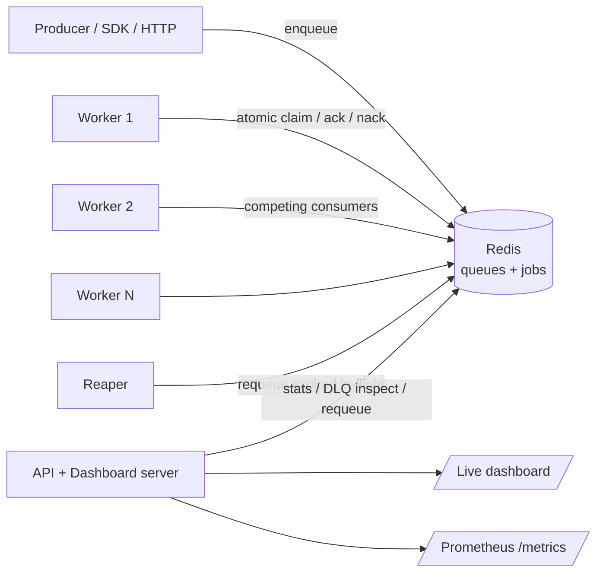

# Relay — Distributed Task Queue (Go + Redis)

**Status:** Approved design · **Date:** 2026-06-07
**Working name:** `relay` (alternatives considered: `hopper`, `forge`, `drover`)

## Purpose & goals

A portfolio-grade distributed task queue, written in **Go**, with queue semantics built
**from scratch** on Redis primitives. It exists to back a backend / distributed-systems
SDE-II resume with a credible, demoable GitHub project that proves *understanding* of queue
internals — not just the ability to install a library.

**One-line pitch:** *"A distributed task queue in Go with at-least-once delivery, visibility
timeouts, retries with backoff, dead-letter queues, priority/delayed jobs, and a live
dashboard — queue semantics built from scratch on Redis primitives."*

Success criteria:

- Reads as "production-quality engineer" to recruiters (polished README, live demo, CI badge).
- Survives senior-interview probing on delivery guarantees, atomic claim, visibility timeout.
- Coherent with the resume's backend story; demoable via a public link, not a `git clone`.

## Key decisions

| Decision | Choice | Rationale |
|---|---|---|
| Scope | Deep / impressive | Strong senior signal; user opted in. |
| Build vs wrap | Build mechanics from scratch | The whole point — proves understanding, not configuration. |
| Language | **Go** | User's choice; differentiator for backend roles. Code kept well-commented to double as a Go ramp (user knows Go "a little"). |
| Durability substrate | **Redis** (Approach A) | Plays to user's Redis experience; lets focus stay on queue *semantics*; most demoable. |
| Postgres-backed mode | **Future work**, not now | `SELECT … FOR UPDATE SKIP LOCKED` does the hard concurrency part for you — keep as a stretch. |
| Dashboard | Embedded plain-JS assets via `go:embed` | Go-idiomatic, no separate build toolchain; keeps focus on the engine. |
| Rate limiting | In Phase 2 | User approved the full deep feature set. |
| Delivery guarantee | **At-least-once** (explicit) | Exactly-once is impossible without idempotent consumers; we provide idempotency keys and state this plainly. |

## Architecture



Multiple competing-consumer workers pull from a single logical broker backed by Redis. All
semantics are ours; Redis is the durable substrate.

## Components (each independently testable)

| Unit | Responsibility | Depends on |
|---|---|---|
| `job` | Job model + encoding (id, queue, payload, state, attempts, maxRetries, timestamps, visibility deadline, idempotency key) | — |
| `broker` | Core engine: enqueue, atomic claim, ack, nack, DLQ move, reaper, promoter. **The heart.** | Redis, `job` |
| `broker/scripts` | Atomic **Lua scripts** (claim+set-deadline, ack, nack-with-backoff, promote-delayed), embedded via `go:embed` | Redis |
| `worker` | Consumer runtime: claim loop, handler dispatch, heartbeat (extend visibility for long jobs), graceful shutdown | `broker` |
| `client` | Producer SDK to enqueue (delayed / priority / idempotent) | `broker` |
| `api` | HTTP: enqueue, queue stats, list/inspect DLQ, requeue-from-DLQ | `broker` |
| `metrics` | Prometheus counters/gauges (enqueued, processed, retried, dead, in-flight, latency) | — |
| `web` | Embedded dashboard (live queue depths, throughput, in-flight, DLQ) | `api` |

## Redis data model

- `job:{id}` — hash holding the full job
- `q:{name}:ready` — ZSET scored by priority (priority queues)
- `q:{name}:delayed` — ZSET scored by ready-at timestamp (scheduled / backoff jobs)
- `q:{name}:inflight` — ZSET scored by visibility deadline (drives the reaper)
- `q:{name}:dlq` — list of exhausted jobs
- `q:{name}:dedup` — set/hash of idempotency keys (optional enqueue dedup)

## Data flow & the hard parts

1. **Enqueue** → write `job:{id}`, add to `ready` (or `delayed` if scheduled). Optional idempotency-key check.
2. **Claim** (atomic Lua) → pop highest-priority id from `ready`, add to `inflight` with `deadline = now + visibilityTimeout`, bump attempts. Atomicity makes competing consumers safe — the centerpiece interview talking point.
3. **Process** → worker runs handler; long jobs heartbeat to extend the deadline.
4. **Ack** → remove from `inflight` + delete `job:{id}`.
5. **Nack/fail** → if `attempts < maxRetries`: re-add to `delayed` with exponential backoff + jitter; else move to `dlq`.
6. **Reaper** (background) → scan `inflight` for `deadline < now`, requeue to `ready`. Delivers at-least-once on worker crash.
7. **Promoter** (background) → move due `delayed` jobs into `ready`.

## Delivery guarantee

**At-least-once.** Not exactly-once (impossible without cooperating idempotent consumers).
We provide idempotency-key support so consumers can dedup. The README states this plainly and
explains why.

## Feature set (deep scope)

Competing consumers · priority queues · delayed/scheduled jobs · retries with exponential
backoff + jitter · DLQ · visibility timeout + reaper · idempotency keys · per-queue rate
limiting (token bucket) · Prometheus metrics · live dashboard.

## Error handling

- Worker crash → visibility timeout → reaper redelivers.
- Poison message → max attempts → DLQ (inspectable + requeue-able from dashboard).
- Redis transient error → bounded retry with backoff in client.
- Graceful shutdown → stop claiming, finish or nack in-flight, exit clean.

## Testing

- **Lua/broker unit tests** against a real Redis (CI service container) — claim atomicity, backoff math, DLQ thresholds.
- **Integration**: enqueue→process→ack; simulated crash→redelivery; DLQ after N fails; delayed timing; priority ordering.
- **Concurrency** (`go test -race`): many workers competing — assert each job delivered ≥once and effectively acked once.
- **CI** (GitHub Actions): Redis service, `go test -race`, `golangci-lint`, build. Badge in README.

## Repo layout

```
relay/
  cmd/{server,worker,demo}/main.go   # API+dashboard, worker daemon, load generator
  internal/{broker,job,worker,client,api,metrics}/
  internal/broker/scripts/*.lua
  web/                               # embedded dashboard assets
  deployments/docker-compose.yml     # redis + server + N workers + demo
  .github/workflows/ci.yml
  README.md  Makefile
```

## Deploy & README (recruiter-facing surface)

- `docker compose up` → full stack + a demo load generator, so the dashboard is alive on first run.
- Deployed demo on Fly.io / Railway (managed Redis) so recruiters click a link.
- README opens with: pitch → mermaid diagram → live-demo link/GIF → 30-second run →
  **Design & tradeoffs** (at-least-once rationale, atomic-claim Lua, visibility timeout) →
  features → **Future work** (Postgres `SKIP LOCKED` mode, exactly-once via consumer outbox).

## Build order

- **Phase 1 (core, must-ship):** job model; enqueue/claim/ack/nack Lua; reaper; worker runtime; basic DLQ; integration tests; CI.
- **Phase 2 (the "impressive"):** delayed jobs + promoter; priority; backoff + jitter; idempotency; rate limiting; metrics.
- **Phase 3 (recruiter polish):** dashboard; docker-compose demo; deployed demo; README + diagram.
- **Future work (not now):** Postgres-backed mode; exactly-once via consumer outbox.

## Out of scope

- Postgres-backed durability (future work).
- Exactly-once delivery semantics.
- Reimplementing Redis durability/replication (Redis provides the substrate).
- A separate React/SPA dashboard build pipeline (embedded plain-JS only).
